# **ARM Computer Architecture LAB**

Report for computer architecture lab in which we developed an ARM CPU from scratch.

---

## **Instruction Fetch (IF)**

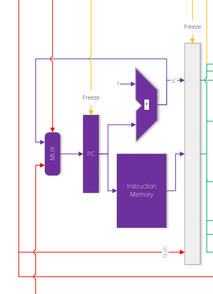  
*Fig.1: Instruction Fetch (IF) of ARM DP*

### **Overview**

This stage is responsible for reading instructions from memory and sending them to the Instruction Decode (ID) stage for decoding. It has four prime modules that handle the following:

- **PC Register Logic**: Tracks the last fetched command address and handles branching.
- **Hazard Handling**: Ensures pipeline continuity by ignoring hazards during branching.

#### Key Code Snippet:

```verilog
register pc(clk, rst, (~freeze) | (branchTaken), PCIn, PCOut);
```

The "load" signal logic for the PC register ensures that if a branch occurs, the branched address is loaded into the PC register.

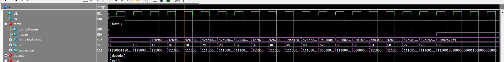  
*Fig.2: Simulation of IF*

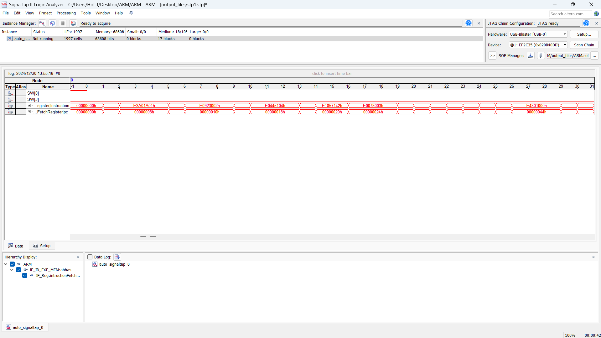  
*Fig.3: Signal Tab of IF*

### **Key Modules**

1. **Instruction Memory**: Simulates real instruction memory using a `switch-case` structure.

    ```verilog
    module InstructionMemory(
        input [31:0] memAddr,
        output reg [31:0] mem
    );
    ```

2. **Register Module**: Provides reusable parameterized registers with flush functionality.

    ```verilog
    module register #(parameter WIDTH = 32) (
        input clk, rst, loaden, [WIDTH-1:0] pin,
        output [WIDTH-1:0] pout
    );

    module registerWithFlush #(parameter WIDTH = 32) (
        input clk, rst, flush, loaden, [WIDTH-1:0] pin,
        output [WIDTH-1:0] pout
    );
    ```

3. **Program Counter (PC)**: Increments the PC register value by 4.

    ```verilog
    module ProgramCounter(
        input [31:0] pcIn,
        output [31:0] pcOut
    );
    ```

4. **2-to-1 Multiplexer**: Selects between two inputs based on a control signal.

    ```verilog
    module Mux2to1(
        input select,
        input [31:0] in0, in1,
        output [31:0] out
    );
    assign out = (select == 1'b1) ? in1 : in0;
    endmodule
    ```

### **Input/Output**

- **Inputs**: Branch address, branch signal, and freeze signal.
- **Outputs**: Extracted instructions, PC value incremented by 4.

---

## **Instruction Decode (ID)**

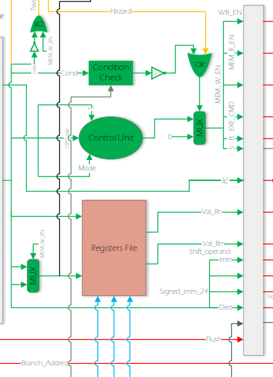  
*Fig.4: Instruction Decode (ID) of ARM DP*

### **Overview**

This stage decodes the instruction fetched from the IF stage and prepares it for execution. It comprises:

- **Condition Check**
- **Control Unit**
- **Register File**

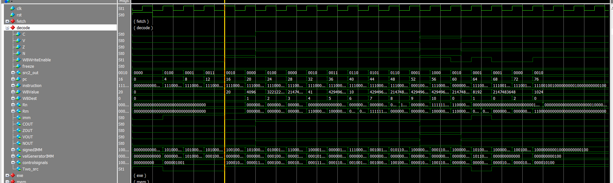  
*Fig.5: Simulation of ID*

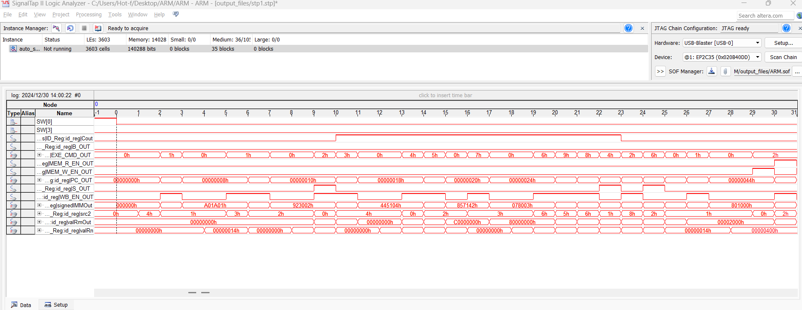  
*Fig.6: Signal Tab of ID*

### **Key Modules**

1. **Register File**:

    ```verilog
    module RegisterFile(
        input clk, rst, [3:0] src1, src2, destWB,
        input [31:0] resultWB,
        input writeBackEn,
        output reg [31:0] reg1, reg2
    );
    ```

2. **Control Unit**:

    ```verilog
    module ControlUnit(
        input [3:0] opCodeIn,
        input [1:0] modeIn,
        input SIn,
        output [8:0] out
    );
    ```

3. **Condition Check**:

    ```verilog
    module ConditionCheck(
        input [3:0] cond,
        input z, c, n, v,
        output reg flag
    );
    ```

---

## **Execution (EXE)**

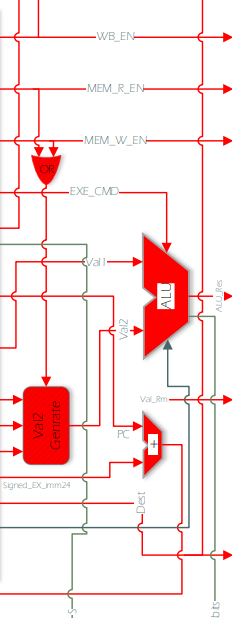  
*Fig.7: Execution Stage*

### **Overview**

This stage handles calculations and branch address generation. Key components include:

- **Arithmetic Logic Unit (ALU)**: Performs arithmetic operations.
- **Val2Generator**: Determines the second ALU input based on instruction type.
- **Program Counter Adder**: Calculates branch addresses.

#### Key Code Snippet:

```verilog
assign branchAddress = PC + {{6{signedIMM[23]}}, signedIMM, 2'b00};
```

---

## **Memory**

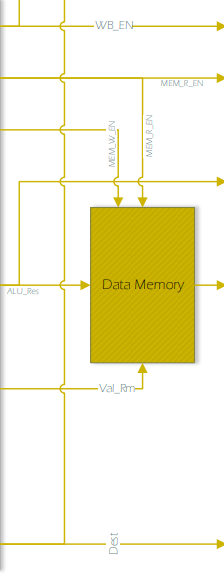  
*Fig.10: Memory Stage*

### **Overview**

This stage handles memory read and write operations. It supports:

- **FPGA SRAM Chips**
- **Cache Integration**

---

## **Hazard Unit**

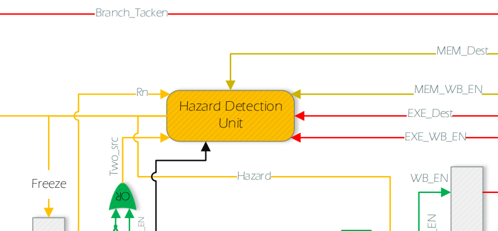  
*Fig.14: Hazard Detection*

### **Overview**

Detects and resolves Read After Write (RAW) hazards. Operates in two modes:

1. **Without Forwarding**: Prevents hazards by stalling the pipeline.
2. **With Forwarding**: Utilizes forwarded values to avoid unnecessary stalls.

---

## **Forwarding Unit**

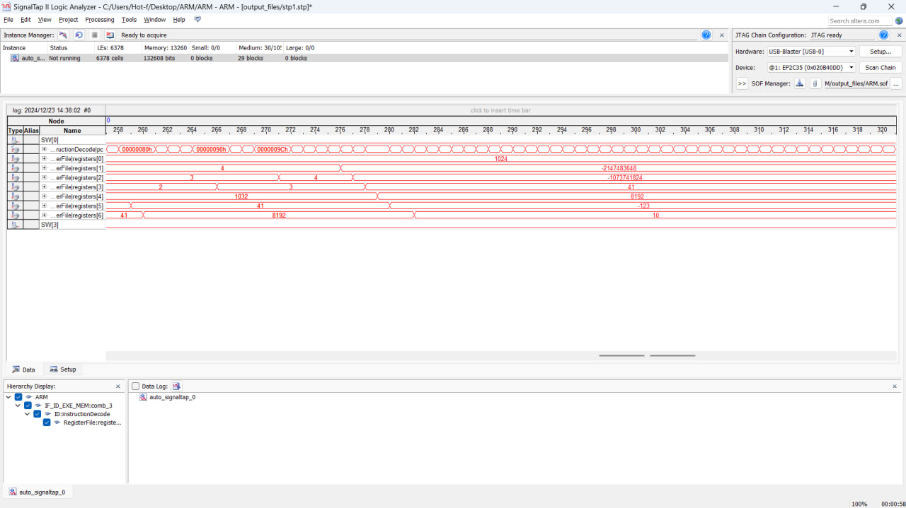  
*Fig.17: Forwarding Unit*

### **Overview**

Reduces pipeline stalls by forwarding valid values to the execution stage.

---

## **SRAM Integration**

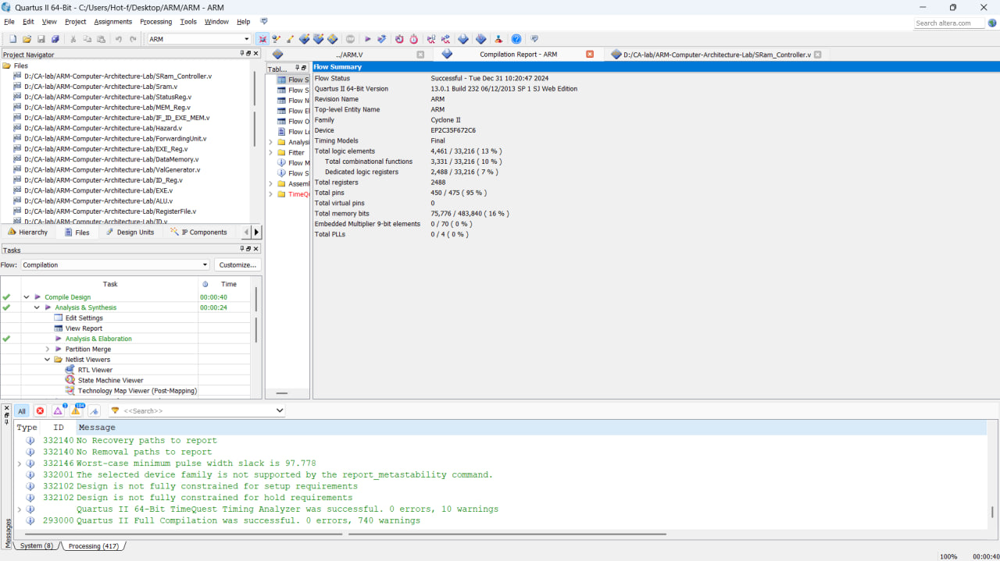  
*Fig.21: SRAM Simulation*

### **Overview**

Handles realistic memory access with Altera Cyclone-II SRAM chips.

---

## **Cache Integration**

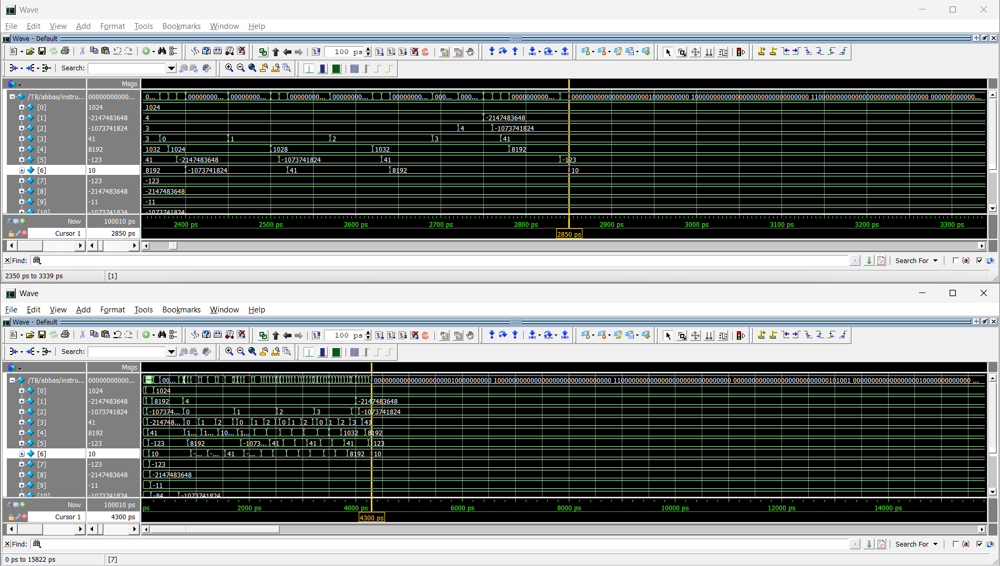  
*Fig.24: Cache Simulation*

### **Overview**

Two-way, 64-bit cache with LRU replacement. Provides a speed-up by improving memory access efficiency.

---

